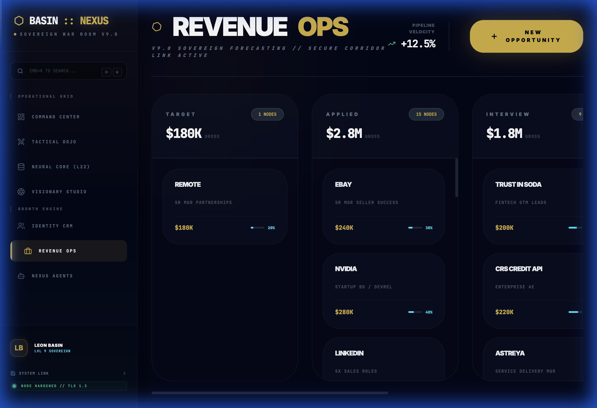

# Executive GTM Signal Engine

**A lightweight operating system for revenue leaders.**
Turning noise into decision-grade artifacts through clear visualization and automated judgment.



## The Problem
Revenue leaders and GTM operators are often trapped in "reporting," not "deciding." CRMs act as data warehouses, not flow engines. The friction of updating a deal stage or finding a contact creates a cognitive tax that degrades decision quality.

## The Solution
This engine separates **Signal** (what matters) from **Noise** (raw data). It is designed with "Director-Grade" constraints:
*   **Zero-Latency Interactions:** Native HTML5 Drag-and-Drop for pipeline physics.
*   **Sovereign Data:** All intelligence resides locally or in controlled secure shards.
*   **Execution First:** Tools that output artifacts (briefs, emails), not just dashboards.

## Core Capabilities (Live)

### 1. Revenue Ops: Pipeline Physics
A Kanban interface designed for **Flow State**.
*   **Visual Velocity:** Immediate feedback on deal progression.
*   **Frictionless Transitions:** Drag-and-drop mechanics to reduce the interaction cost of updating deal status.
*   **Dopamine Visualization:** Positive reinforcement feedback loops upon closing revenue.

### 2. Network Intelligence (CRM)
*   **Identity Shards:** Structured storage for high-value contact data.
*   **LinkedIn Sentinel Protocol:** Automated protocols for identifying profile visitors and converting them to leads (simulated).

## Technical Philosophy
This codebase prioritizes **Maintenance Economics** and **Conceptual Integrity**.

*   **Stack:** React + Vite + Tailwind 3.4
*   **Constraint:** Native APIs preferred over heavy dependencies (e.g., HTML5 DnD vs. libraries).
*   **Modularity:** The Engine is decoupled from the Command Center (Site) to allow independent scaling.

## References & Design Theory
*   **Modularity:** Parnas, D. L. (1972). On the criteria to be used in decomposing systems into modules. *Communications of the ACM*, 15(12), 1053–1058.
*   **Usability:** Norman, D. A. (2013). *The Design of Everyday Things* (Revised and expanded edition). Basic Books.

## Installation & Deployment
```bash
npm install
npm run dev
```
## Status
**Active Development.** v9.0 Sovereign Edition.
*Current Focus:* Vector A (Artifact Generation).
